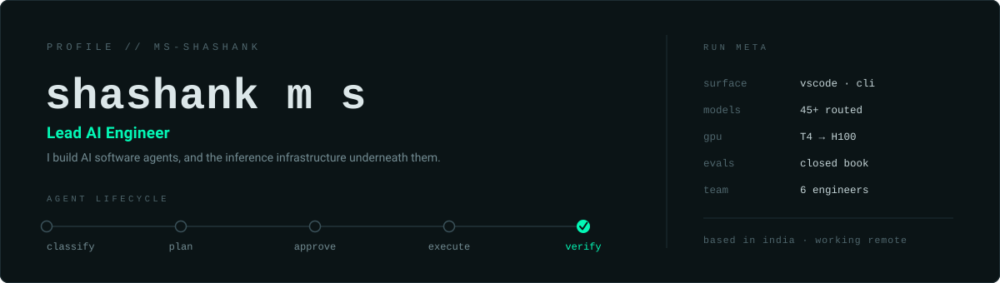
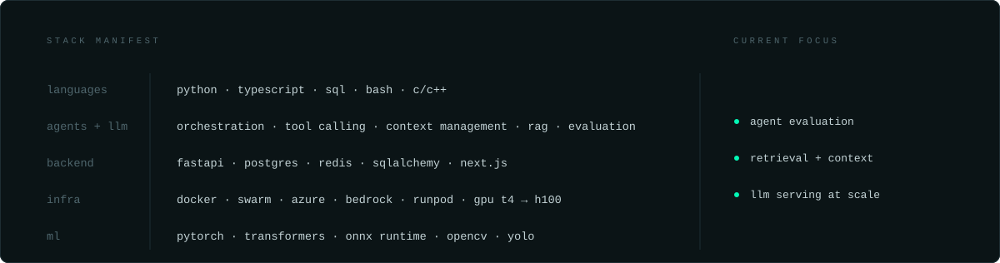

<picture>
  <source media="(prefers-color-scheme: dark)" srcset="assets/header-dark.svg">
  <source media="(prefers-color-scheme: light)" srcset="assets/header-light.svg">
  
</picture>

  
  &nbsp;&nbsp;&nbsp;
  
  &nbsp;&nbsp;&nbsp;
  
  &nbsp;&nbsp;&nbsp;
  

 

### What I work on

I lead engineering on **[OxCode](https://marketplace.visualstudio.com/items?itemName=oxloai.oxcode-ai)**, an agentic AI software engineer that ships as a VS Code extension and a CLI. I own its orchestration core: the lifecycle in the header above, running on an explicit state machine, with per-role model routing, sub-agent dispatch, and a verifier designed to catch vacuous or weakened tests rather than trust the model's own report.

Before that I architected the **[Oxlo.ai](https://oxlo.ai)** backend from scratch: a serverless LLM inference platform with an OpenAI-compatible API, intelligent routing across Azure AI Foundry, AWS Bedrock and self-hosted GPU workers over 45+ models, quota-aware fallback chains, per-plan rate limiting, usage metering and billing. I deployed and auto-scaled LLM and diffusion inference on T4, L40S, A100 and H100 clusters.

Most of the difference between a coding agent that works and one that wastes your afternoon is not the model. It is the harness around it: context management, tool design, the verification loop, and whether the system tells you the truth about what it actually did. That is the problem I spend my time on, and it is why I benchmark instead of demo.

### Shipped

| | |
|---|---|
| **[OxCode](https://marketplace.visualstudio.com/items?itemName=oxloai.oxcode-ai)** | An AI software engineer for VS Code and the terminal. Published on the Visual Studio Marketplace. |
| **[Oxlo.ai](https://oxlo.ai)** | Serverless LLM inference platform. I built and own the backend. |
| **[oxcode-evals](https://github.com/Oxcode-ai/oxcode-evals)** | Reproducible agent evaluations with published methodology and prompts. |

### Selected open source

**[Person Detection, Tracking and Re-Identification](https://github.com/ms-shashank/Person-Detector-and-Tracking)**
YOLOv8 detection, Deep SORT tracking and OSNet re-identification. Holds a stable ID per person through occlusion and re-entry into frame.

**[AI Code Debugger](https://github.com/ms-shashank/AI-Code-Debugger)**
A role-based LangGraph workflow (Parser, Fixer, Reviewer) with iterative reasoning loops and dynamic model selection for cost and performance tradeoffs.

**[Universal Document Intelligence Chatbot](https://github.com/ms-shashank/Universal-Document-Intelligence-Chatbot)**
Answers questions across uploaded documents (PDF, DOCX, TXT, CSV, XLSX) and live web search, routing each query to whichever source can actually answer it, with citations.

**[PolicyPulse](https://github.com/ms-shashank/-PolicyPulse-Internal-Policy-Compliance-Checker)**
Document and email scanning that flags policy violations through configurable rules for PII, confidential material and compliance terms, with a dashboard and REST API.

**[Traffic Sign Detection](https://github.com/ms-shashank/Traffic-sign-detection-Fine-Tuned-model-using-YOLOv5)**
Fine-tuned YOLOv5 for traffic sign recognition.

 

<picture>
  <source media="(prefers-color-scheme: dark)" srcset="assets/stack-dark.svg">
  <source media="(prefers-color-scheme: light)" srcset="assets/stack-light.svg">
  
</picture>

Stack as text

- **Languages** — Python, TypeScript, SQL, Bash, C/C++
- **Agents and LLM** — agent orchestration, tool calling, context management, RAG, evaluation harnesses, LangGraph, LangChain, ONNX embeddings
- **Backend** — FastAPI, Postgres, Redis, SQLAlchemy, Alembic, Next.js
- **Infrastructure** — Docker and Swarm, Azure (VM, Blob, Postgres, AI Foundry), AWS Bedrock, RunPod, SaladCloud, GPU serving on T4 / L40S / A100 / H100
- **ML** — PyTorch, Transformers, ONNX Runtime, OpenCV, YOLO, spaCy

